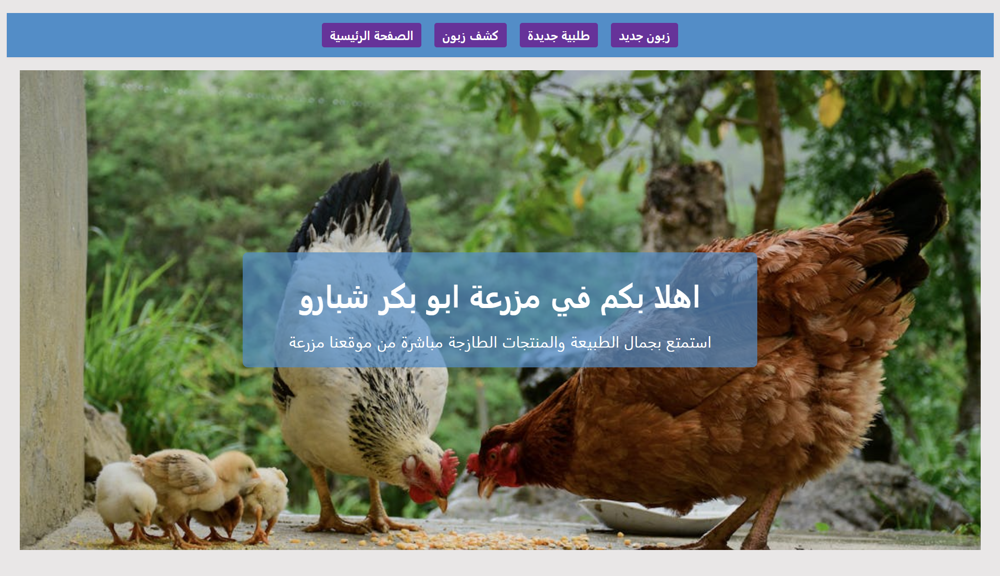
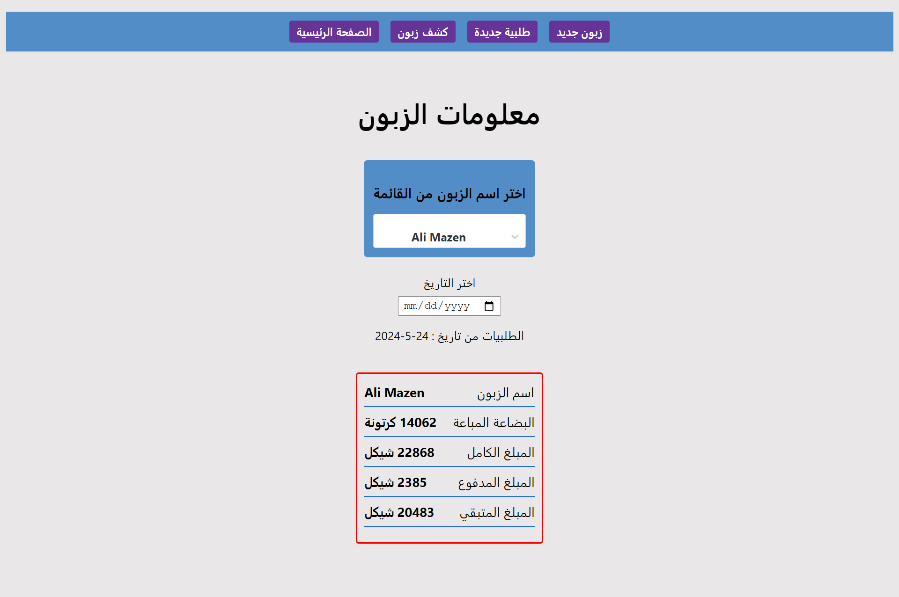
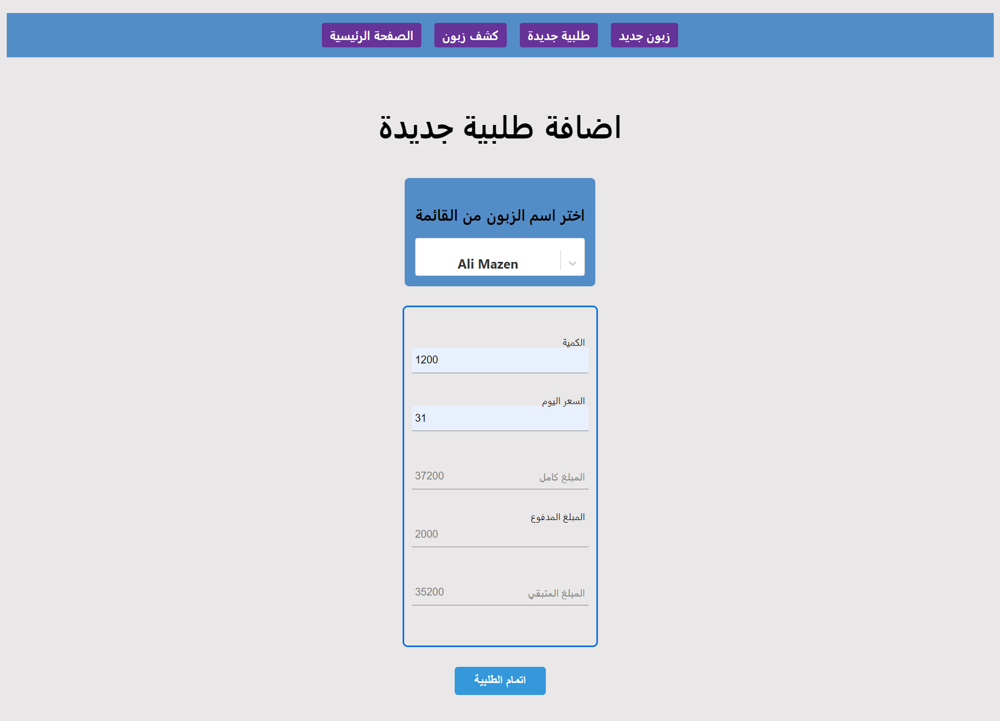

# Farm Project



## Overview

Farm Project is a web application designed to help farm owners manage their finances. The application allows users to calculate all money coming in and going out of the farm. Built with Node.js, Express, React, HTML, and CSS, this application provides a user-friendly interface for financial management in the agricultural sector.

## Features

- **Income Tracking:** Easily log and track all sources of income for your farm.
- **Expense Management:** Keep a record of all expenses incurred.
- **Financial Summary:** Get a comprehensive view of your farm's financial health.
- **User Authentication:** Secure login and registration system.
- **Responsive Design:** Accessible on all devices, from desktops to mobile phones.

## Pages

### 1. Home Page

The home page provides an overview of the application, with quick links to various sections. It also displays recent income and expense entries.

  <!-- Replace with actual image link -->

### 2. Client Information Page

On the Client Information Page, users can view all the customer's financial data

  <!-- Replace with actual image link -->

### 3. New Order Page

The New Order Page allows users to record new Order for Client

  <!-- Replace with actual image link -->

### 4. New Client Page

The New Client page allows users to record new clients in Database.

  <!-- Replace with actual image link -->

![After adding Client] (public/screencapture-localhost-3000-neworder-2024-05-24-14_22_29.png)


## Installation

1. Clone the repository:
   ```bash
   git clone https://github.com/yourusername/farm-project.git
   cd farm-project
